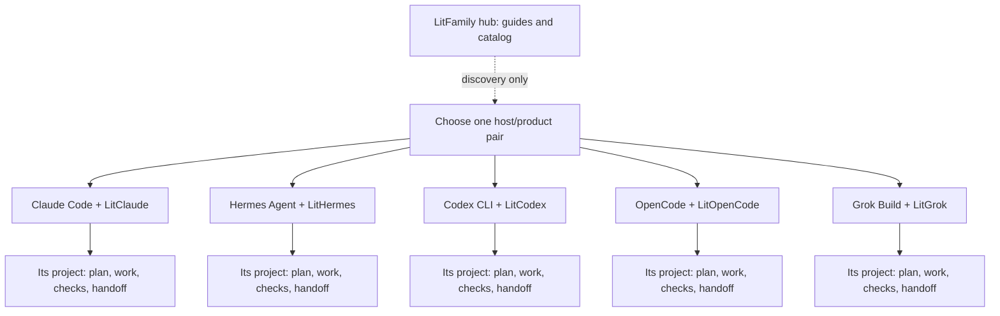

<p align="center"><picture><source media="(prefers-reduced-motion: reduce)" srcset="assets/brand/exports/litfamily-cover-motion-still.webp" /></picture></p>
<p align="center"><a href="assets/brand/exports/litfamily-cover-motion-still.webp">View the still frame</a> · <a href="assets/brand/exports/litfamily-cover-film.mp4">Watch the 11-second film with sound</a></p>

# LitFamily

**Keep the work lit.**

Plan the work, make something, check it, and leave the next step with your project.

**[Install](#install) · [Quick start](#quick-start) · [Key features](#key-features) · [Commands and hooks](#commands-and-hooks) · [Links](#links) · [한국어](README_ko-KR.md)**

<p align="center"></p>

<details>
<summary>Copy ASCII logo</summary>

```text
          ▄▖  ▄█▄
▗▄▄▖    ▄██▌  ▜█▛
▐██▌  ▄████████████▜▛
▐██▌ ▐█▀▀▀▀▀▀▀▀▀▀▀▀▘
▐██▌   ▄█▌█████████▌
▐██▌ ▄██▛▘  ▗▄▄  ▗
▐██▌▐█▛▘    ▐██  ▝▀
▐██▌▝       ▐██
▐██████▘    ▐██
▝▀▀▀▀▀      ▝▀▀
```

</details>

<p align="center">


</p>

<p align="center">
<a href="docs/skills.md"> Docs</a> &nbsp; <a href="assets/brand/exports/ignition-film.mp4"> Ignition</a> &nbsp; <a href="LICENSE"> MIT</a>
</p>

## Install

Choose **one** product. Follow its README for supported Node.js and host versions, installation, and activation checks. No other LitFamily product is required.


> [!NOTE]
> **Released on npm.** Each product is published under the `@litfamily` npm scope. The versions and release commits are listed in [release status](docs/release-status.md). The GitHub repositories, including this hub, are private for now, so the product links below require access.

### Product READMEs

- [LitClaude](https://github.com/wjgoarxiv/litclaude) — Claude Code.
- [LitHermes](https://github.com/wjgoarxiv/lithermes) — Hermes Agent.
- [LitCodex](https://github.com/wjgoarxiv/litcodex) — Codex CLI.
- [LitOpenCode](https://github.com/wjgoarxiv/litopencode) — OpenCode.
- [LitGrok](https://github.com/wjgoarxiv/litgrok) — Grok Build.

Install with the npm command in that product's README. Each npm page shows the same command: [`@litfamily/litclaude`](https://www.npmjs.com/package/@litfamily/litclaude) · [`@litfamily/lithermes`](https://www.npmjs.com/package/@litfamily/lithermes) · [`@litfamily/litcodex`](https://www.npmjs.com/package/@litfamily/litcodex) · [`@litfamily/litopencode`](https://www.npmjs.com/package/@litfamily/litopencode) · [`@litfamily/litgrok`](https://www.npmjs.com/package/@litfamily/litgrok). The hub has no universal installer. Host configuration, login, interactive choices, and removal differ by product.

## Quick start

Start in an empty project after completing the product's activation checks. Try a small task that needs no external data or dependency installation:

```text
lit Build a to-do list in a single HTML file without external dependencies.
Implement add, complete, and delete. Check the behavior and leave the next step.
```

In **Grok Build**, use its explicit skill route instead:

```text
/litwork Build a to-do list in a single HTML file without external dependencies.
Implement add, complete, and delete. Check the behavior and leave the next step.
```

Open the result yourself and try adding, completing, and deleting an item. Ask the agent what it actually checked and what remains unchecked. If a browser is unavailable, a generated file alone does not prove that the interface works. A logo or activation message shows entry into the workflow, not completion of the task.

## Key features

A spark has been placed in your hands. Give it a project to live in.

A bug you want fixed. A screen you want built. A project you want to finish.

Starting takes a line. After a long conversation or a session change, carrying on takes more: finding what you decided, what you checked, and what is still left to do.

**LIT gives that work a place to stay.** Goals, plans, checked results, and next steps remain with the project so the next session has something to pick up. Choose the product for the harness you already use; the five products are independent.

### Product entry points

- **Claude Code** — [LitClaude](https://github.com/wjgoarxiv/litclaude): A project conversation beginning with `lit`.
- **Hermes Agent** — [LitHermes](https://github.com/wjgoarxiv/lithermes): Load the plugin and check its skills before using `lit`.
- **Codex CLI** — [LitCodex](https://github.com/wjgoarxiv/litcodex): A project conversation beginning with `lit`.
- **OpenCode** — [LitOpenCode](https://github.com/wjgoarxiv/litopencode): Select the `lit-loop` agent and describe the task.
- **Grok Build** — [LitGrok](https://github.com/wjgoarxiv/litgrok): Review hook trust, then invoke `/litwork`.

### A shared workflow

```text
Plan → Build → Verify → Hand off
```

| Step | Leave something useful |
|---|---|
| **Plan** | The result you want, its constraints, and how to tell it works |
| **Build** | The smallest useful change in the current project |
| **Verify** | Checks that ran, their results, and anything still unverified |
| **Hand off** | Decisions, relevant file paths, and the next action |

Before ending the session, ask it to save that handoff. In the next session, point the agent to the saved record and ask it to read it before continuing. Record paths and resume tools are specific to each product; follow its guide.

**Keep the work lit** means leaving work that can be continued. It does not mean that a closed session keeps running, or that a new session automatically knows everything.

## Commands and hooks

Choose the one product that matches your host. Append `lit` to a prompt where that host supports the bare route; Grok Build uses `/litwork`. Ask for `handoff` to carry the checked result into another session. Use `lit-plan` before work, `/start-work` only for an approved plan, and `/review-work` to inspect the result. `litresearch` is available only in products that document it.

| You need | Start here |
| --- | --- |
| Begin the work loop | `lit` (or the host's documented explicit route) |
| Carry the next step | `handoff` / `/lit-handoff` |
| Plan, execute, review | `lit-plan` → `/start-work` → `/review-work` |
| Source-backed research | `litresearch` where the selected product ships it |

## Troubleshooting

Keep your existing configuration and read the selected product's migration guide before replacing an installation. If an ownership check refuses a destination, retain the error and existing files; do not delete state to force a retry.

Use only the diagnostic and removal commands that product documents. **There is no family-wide `doctor` or uninstall command.** In particular, LitGrok has no `doctor` command, and LitOpenCode removal follows its manual guide. Check what happens to customized files before removing anything.

For a problem, follow [Support](SUPPORT.md): include the product and host version, redacted command, expected behavior, and observed output. Installation, skill discovery, and task completion are separate observations. Publishing, destructive actions, and changes to access still require your project's authorization.

## Links

### Documentation

Choose a task before choosing a skill. The [complete skill catalog](docs/skills.md) lets you explore planning, execution, review, research, visualization, English and Korean prose editing, Word and PowerPoint files, diagrams, short films and READMEs, with the requirements for each host. Every product now includes `lit-humanizer`, `lit-docx`, `lit-pptx`, `lit-diagram-drawer`, `lit-typographic-motion` and `readme-studio`. A matching skill name does not make it portable between hosts.

The five product READMEs above explain the actual installation paths, entry points, permissions, optional tools, and limitations. This hub helps you find them; it does not add a shared runtime.

### Skills and native marketplaces

The [complete skill catalog](docs/skills.md) records every native entry and supporting skill document, with host-specific compatibility. Install the matching product for its full native workflow. The root `skills/` directory provides independently verified direct exports and currently contains the complete Grok Build `lit-humanizer` skill tree, checked for file hashes and reference closure. Other host variants remain traceable in the catalog by product, source path and commit.

[Claude marketplace and Codex pointer](docs/marketplaces.md) · [Brand artwork and licenses](assets/brand/README.md) · [Contributing](CONTRIBUTING.md) · [Security](SECURITY.md) · [Support](SUPPORT.md) · [Code of conduct](CODE_OF_CONDUCT.md) · [Privacy](PRIVACY.md) · [License](LICENSE)

### LITFAMILY

<details>
<summary>Additional workflows and editorial visuals</summary>

## How the family fits together

The hub helps you find a product; it does not run your work. Choose one host/product pair. Its plans, working files, checks, and handoffs belong to that project, with record paths defined by that product.



These are five alternatives, not five stages to install. Products do not share a runtime or depend on one another. The diagram summarizes the workflow; commands, permissions, and record formats remain specific to each host.

### Product editorial cues

<table><tr>
<td><a href="https://github.com/wjgoarxiv/litclaude"></a><br /><strong>LitClaude</strong><br />on npm</td>
<td><a href="https://github.com/wjgoarxiv/lithermes"></a><br /><strong>LitHermes</strong><br />on npm</td>
<td><a href="https://github.com/wjgoarxiv/litcodex"></a><br /><strong>LitCodex</strong><br />on npm</td>
<td><a href="https://github.com/wjgoarxiv/litopencode"></a><br /><strong>LitOpenCode</strong><br />on npm</td>
<td><a href="https://github.com/wjgoarxiv/litgrok"></a><br /><strong>LitGrok</strong><br />on npm</td>
</tr></table>

[](assets/brand/exports/ignition-film.mp4)

## Practical routes and editorial cues

Use these routes only through the product and host you selected. `lit` starts the work loop where the host supports the bare route; `handoff` records the checked result and next step; `lit-plan` lays out an approved path; `/start-work` executes that approved plan; `/review-work` inspects the result; and `litresearch` is available only when the selected product documents it. Grok Build documents `/litwork` as its explicit entry. Each route has a product-specific host limit: this hub only explains the choices and does not execute them, install a runtime, or make unsupported routes available.

<table>
<tr>
<td><strong>LitClaude</strong><br /></td>
<td><strong>LitHermes</strong><br /></td>
<td><strong>LitCodex</strong><br /></td>
<td><strong>LitOpenCode</strong><br /></td>
<td><strong>LitGrok</strong><br /></td>
</tr>
</table>

## LITFAMILY


Claude, Hermes, Codex, OpenCode, and Grok, pictured as five armored machines. Choose the product for the tool you use. This is an editorial illustration of the family, not a screenshot of the software.

## See the mark

[](assets/brand/exports/ignition-film.mp4)

[Play the 10-second film](assets/brand/exports/ignition-film.mp4) · [Animated GIF](assets/brand/exports/ignition-demo.gif) · [Static poster](assets/brand/exports/ignition-poster.png) · [Brand gallery](assets/brand/gallery.html)

An authored motion graphic illustrates the LitFamily workflow. It is a brand demonstration, not a recording of installation or host execution. The animated GIF and the 10-second film are linked above.

<details>
<summary>Ignition cover</summary>


</details>


</details>
