<p align="center"><picture><source media="(prefers-reduced-motion: reduce)" srcset="assets/brand/exports/litfamily-cover-motion-still.webp" />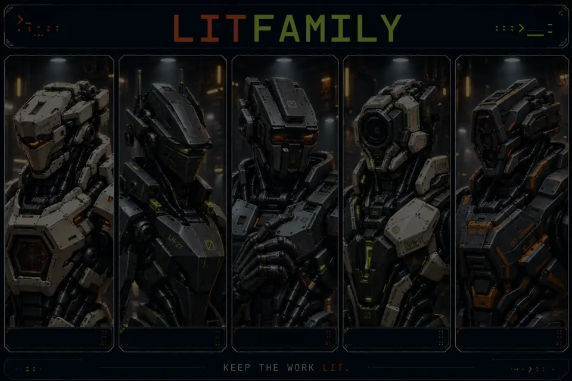</picture></p>
<p align="center"><a href="assets/brand/exports/litfamily-cover-motion-still.webp">정지 프레임 보기</a> · <a href="assets/brand/exports/litfamily-cover-film.mp4">소리와 함께 11초 영상 보기</a></p>

# LitFamily

**Keep the work lit.**

목표와 계획, 확인한 결과, 다음에 할 일을 프로젝트에 남깁니다.

**[설치](#설치) · [빠른 시작](#빠른-시작) · [주요 기능](#주요-기능) · [명령과 훅](#명령과-훅) · [링크](#링크) · [English](README.md)**

<p align="center">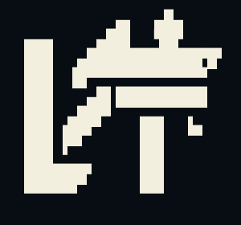</p>

<details>
<summary>Copy ASCII logo</summary>

```text
          ▄▖  ▄█▄
▗▄▄▖    ▄██▌  ▜█▛
▐██▌  ▄████████████▜▛
▐██▌ ▐█▀▀▀▀▀▀▀▀▀▀▀▀▘
▐██▌   ▄█▌█████████▌
▐██▌ ▄██▛▘  ▗▄▄  ▗
▐██▌▐█▛▘    ▐██  ▝▀
▐██▌▝       ▐██
▐██████▘    ▐██
▝▀▀▀▀▀      ▝▀▀
```

</details>

<p align="center">


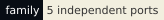
</p>

<p align="center">
<a href="docs/skills.md"> Docs</a> &nbsp; <a href="assets/brand/exports/ignition-film.mp4"> Ignition</a> &nbsp; <a href="LICENSE"> MIT</a>
</p>

## 설치

지금 쓰는 도구에 맞는 제품 **하나**를 고르세요. 지원하는 Node.js와 호스트 버전, 설치 방법과 활성화 확인 절차는 해당 README에서 확인하세요. 다른 LitFamily 제품은 필요하지 않습니다.


> [!NOTE]
> **npm에 출시했습니다.** 각 제품은 npm `@litfamily` 스코프로 배포되어 있습니다. 버전과 출시 커밋은 [출시 상태](docs/release-status.md)에 있습니다. 이 허브를 포함한 GitHub 저장소는 아직 비공개라서, 아래 제품 링크는 접근 권한이 있어야 열립니다.

### 제품 README

- [LitClaude](https://github.com/wjgoarxiv/litclaude) — Claude Code.
- [LitHermes](https://github.com/wjgoarxiv/lithermes) — Hermes Agent.
- [LitCodex](https://github.com/wjgoarxiv/litcodex) — Codex CLI.
- [LitOpenCode](https://github.com/wjgoarxiv/litopencode) — OpenCode.
- [LitGrok](https://github.com/wjgoarxiv/litgrok) — Grok Build.

설치할 때는 제품 README에 있는 npm 명령을 사용하세요. 같은 명령은 각 npm 페이지에서도 볼 수 있습니다: [`@litfamily/litclaude`](https://www.npmjs.com/package/@litfamily/litclaude) · [`@litfamily/lithermes`](https://www.npmjs.com/package/@litfamily/lithermes) · [`@litfamily/litcodex`](https://www.npmjs.com/package/@litfamily/litcodex) · [`@litfamily/litopencode`](https://www.npmjs.com/package/@litfamily/litopencode) · [`@litfamily/litgrok`](https://www.npmjs.com/package/@litfamily/litgrok). 허브에는 공통 설치기가 없습니다. 호스트 설정, 로그인, 설치 중 선택 항목과 제거 방법은 제품마다 다릅니다.

## 빠른 시작

제품이 활성화됐는지 확인한 뒤, 빈 프로젝트에서 작은 작업 하나를 맡겨보세요. 외부 데이터나 의존성 설치 없이 시작할 수 있는 예제입니다.

```text
lit 외부 의존성 없이 HTML 파일 하나로 할 일 목록을 만들어줘.
추가·완료·삭제 동작을 구현하고, 확인한 내용과 다음 행동을 남겨줘.
```

**Grok Build**에서는 명시적인 스킬 경로로 시작합니다.

```text
/litwork 외부 의존성 없이 HTML 파일 하나로 할 일 목록을 만들어줘.
추가·완료·삭제 동작을 구현하고, 확인한 내용과 다음 행동을 남겨줘.
```

결과물을 직접 열어 항목을 추가하고, 완료하고, 삭제해보세요. 에이전트에게 무엇을 확인했고 무엇이 남았는지 물어보세요. 브라우저를 사용할 수 없다면 파일을 만들었다는 사실만으로 화면과 동작을 확인했다고 할 수 없습니다. 로고나 활성화 문구는 작업 흐름에 들어왔다는 표시입니다. 작업이 끝났는지는 따로 확인해야 합니다.

## 주요 기능

불씨를 건네받았다. 이제, 당신의 작업에 옮길 차례다.

고치고 싶은 버그 하나. 만들고 싶은 화면 하나. 끝내고 싶은 프로젝트 하나.

시작은 짧은 한 줄이면 됩니다. 어려운 건 그다음입니다. 대화가 길어지고 세션이 바뀌면, 어디까지 했는지부터 다시 짚어야 합니다. 어떤 결정을 내렸는지, 무엇을 확인했는지, 다음에는 무엇을 해야 하는지.

**LIT은 그 불씨를 남깁니다.** 목표와 계획, 확인한 결과, 다음에 할 일을 프로젝트에 기록합니다. 다음 세션에서 그 기록을 읽고 작업을 이어갈 수 있도록. 쓰던 도구에 맞는 LIT 하나면 됩니다.

### 제품별 시작 경로

- **Claude Code** — [LitClaude](https://github.com/wjgoarxiv/litclaude): 프로젝트 대화에서 `lit`으로 요청.
- **Hermes Agent** — [LitHermes](https://github.com/wjgoarxiv/lithermes): 플러그인 로드와 스킬을 확인한 뒤 `lit`으로 요청.
- **Codex CLI** — [LitCodex](https://github.com/wjgoarxiv/litcodex): 프로젝트 대화에서 `lit`으로 요청.
- **OpenCode** — [LitOpenCode](https://github.com/wjgoarxiv/litopencode): `lit-loop` 에이전트를 선택하고 작업 요청.
- **Grok Build** — [LitGrok](https://github.com/wjgoarxiv/litgrok): 훅 신뢰 설정을 확인하고 `/litwork`로 요청.

### 공통 작업 흐름

```text
계획하기 → 만들기 → 확인하기 → 다음 작업에 건네기
```

| 단계 | 남길 내용 |
|---|---|
| **계획** | 원하는 결과, 제약, 동작을 확인할 기준 |
| **구현** | 현재 프로젝트에 필요한 변경 |
| **검증** | 실행한 검사, 결과, 아직 확인하지 못한 부분 |
| **인계** | 결정 사항, 관련 파일 경로, 다음 행동 |

세션을 마치기 전에 이 내용을 인수인계 기록으로 남겨달라고 요청하세요. 다음 세션에서는 저장한 기록의 경로를 알려주고, 읽은 뒤 작업을 이어달라고 요청하세요. 기록 위치와 재개 도구는 제품마다 다르므로 해당 안내를 따르세요.

“꺼지지 않는 불”은 프로그램이 끝없이 돌아간다는 뜻이 아닙니다. **세션이 끝나도, 이어갈 작업을 남긴다는 뜻입니다.**

## 명령과 훅

호스트에 맞는 제품 하나를 고르세요. Bare route를 지원하는 호스트에서는 프롬프트 끝에 `lit`을 붙이고, Grok Build에서는 `/litwork`를 사용합니다. `handoff`로 확인한 결과를 다음 세션에 건네고, 작업 전에는 `lit-plan`, 승인한 계획 실행에는 `/start-work`, 결과 검토에는 `/review-work`를 사용하세요. `litresearch`는 해당 제품이 제공할 때만 사용할 수 있습니다.

| 필요한 일 | 시작 경로 |
| --- | --- |
| 작업 루프 시작 | `lit` (또는 제품이 문서화한 명시적 경로) |
| 다음 작업 건네기 | `handoff` / `/lit-handoff` |
| 계획·실행·검토 | `lit-plan` → `/start-work` → `/review-work` |
| 출처 기반 조사 | 선택한 제품이 제공하는 경우 `litresearch` |

## 문제 해결

기존 설정을 보관하고, 설치를 교체하기 전에 선택한 제품의 이전 안내를 읽으세요. 소유권 검사에서 설치를 거절하면 오류와 기존 파일을 보존하세요. 재시도를 위해 상태 파일부터 지우지 마세요.

각 제품 문서에 나온 진단·제거 방법을 사용하세요. **LitFamily 공통 `doctor`나 제거 명령은 없습니다.** 특히 LitGrok에는 `doctor` 명령이 없고, LitOpenCode는 문서의 수동 제거 절차를 따릅니다. 직접 수정한 파일이 어떻게 처리되는지 먼저 확인하세요.

문제가 생기면 [지원 안내](SUPPORT.md)에 따라 제품과 호스트 버전, 민감한 내용을 가린 명령, 예상한 동작과 실제 출력을 남겨주세요. 설치, 스킬 발견, 작업 완료는 각각 확인합니다. 공개, 파괴적 작업과 접근 권한 변경에는 프로젝트에서 요구하는 승인이 계속 필요합니다.

## 링크

### 문서

스킬 이름보다 하려는 작업을 먼저 고르세요. [전체 스킬 목록](docs/skills.md)에서 계획, 실행, 검토, 조사, 시각화, 영어와 한국어 문장 편집, Word와 PowerPoint 문서, 다이어그램, 짧은 영상, README 작성 기능과 각 호스트의 요구 사항을 살펴볼 수 있습니다. 이제 모든 제품에 `lit-humanizer`, `lit-docx`, `lit-pptx`, `lit-diagram-drawer`, `lit-typographic-motion`, `readme-studio`가 들어 있습니다. 이름이 같은 스킬이라도 다른 호스트에서 그대로 쓸 수 있는 것은 아닙니다.

실제 설치 위치, 진입점, 권한, 선택 도구와 제약은 위 다섯 제품의 README에 있습니다. 이 허브에서 필요한 제품과 문서를 찾을 수 있습니다. 제품 사이에 공통 실행 환경을 추가하지는 않습니다.

### 스킬과 기본 마켓플레이스

[전체 스킬 목록](docs/skills.md)은 모든 기본 스킬과 보조 문서를 실행 환경별로 분류합니다. 전체 네이티브 워크플로를 쓰려면 사용하는 에이전트에 맞는 제품을 설치하세요. 루트 `skills/`에는 독립 배포를 검토한 스킬을 제공하며, 현재 Grok Build용 `lit-humanizer` 전체 폴더의 파일 해시와 참조 경로를 확인했습니다. 다른 호스트용 변형은 목록의 제품명, 원본 경로와 커밋으로 추적할 수 있습니다.

[Claude 마켓플레이스와 Codex 연결](docs/marketplaces.md) · [브랜드 이미지와 라이선스](assets/brand/README.md) · [기여](CONTRIBUTING.md) · [보안](SECURITY.md) · [지원](SUPPORT.md) · [행동 규칙](CODE_OF_CONDUCT.md) · [개인정보](PRIVACY.md) · [라이선스](LICENSE)

### LITFAMILY

<details>
<summary>추가 제품 안내와 편집 이미지</summary>

## 제품은 어떻게 연결되나요?

허브는 제품과 문서를 찾는 안내서입니다. 작업을 실행하지는 않습니다. 쓰는 호스트에 맞는 제품 하나를 고르면, 그 프로젝트 안에 계획과 작업 파일, 확인 결과, 인수인계 기록을 남깁니다. 기록 위치는 제품별 안내를 따릅니다.

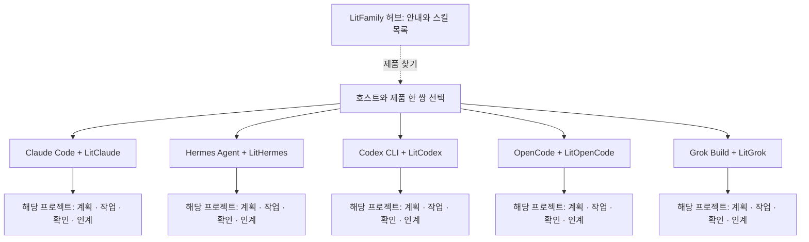

다섯 제품은 설치 순서가 아니라 선택지입니다. 공통 실행 환경이나 제품 사이의 의존성은 없습니다. 그림은 작업 흐름을 요약한 것이며, 실제 명령·권한·기록 형식은 각 호스트의 방식을 따릅니다.

### 제품 편집 이미지

<table><tr>
<td><a href="https://github.com/wjgoarxiv/litclaude">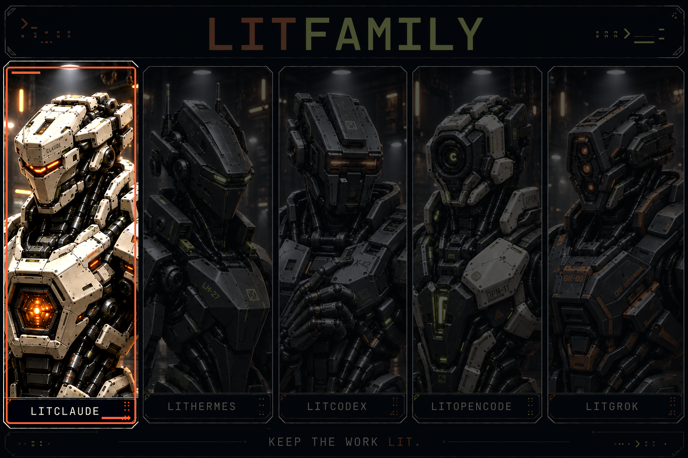</a><br /><strong>LitClaude</strong><br />npm 배포</td>
<td><a href="https://github.com/wjgoarxiv/lithermes">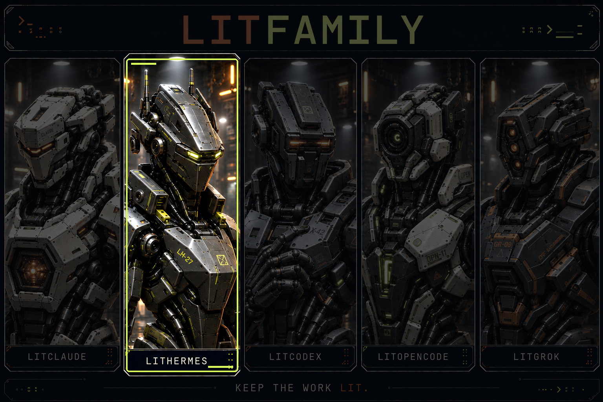</a><br /><strong>LitHermes</strong><br />npm 배포</td>
<td><a href="https://github.com/wjgoarxiv/litcodex">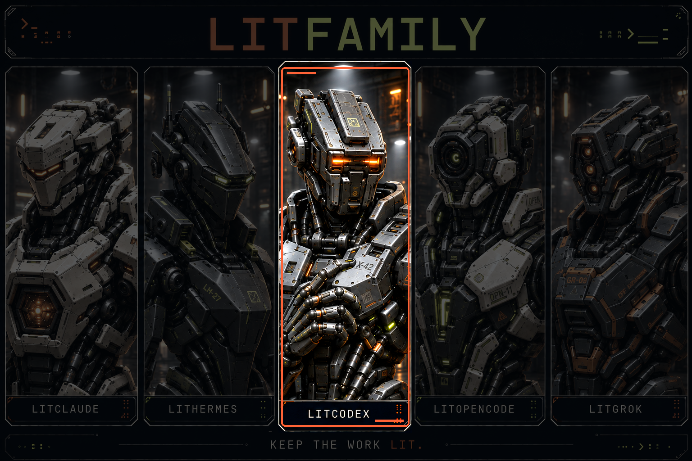</a><br /><strong>LitCodex</strong><br />npm 배포</td>
<td><a href="https://github.com/wjgoarxiv/litopencode">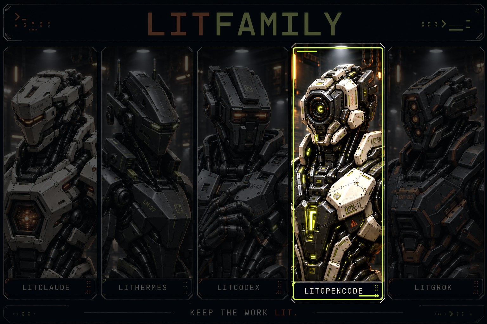</a><br /><strong>LitOpenCode</strong><br />npm 배포</td>
<td><a href="https://github.com/wjgoarxiv/litgrok">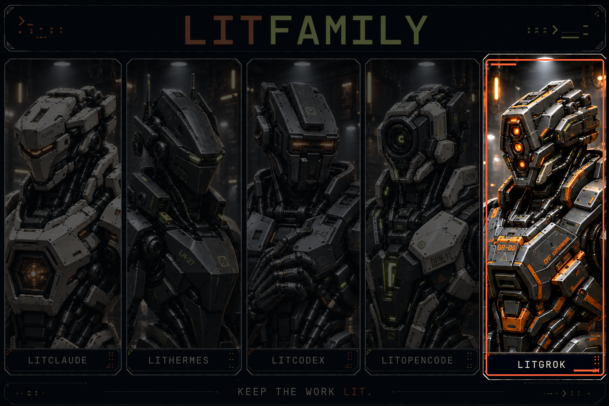</a><br /><strong>LitGrok</strong><br />npm 배포</td>
</tr></table>

[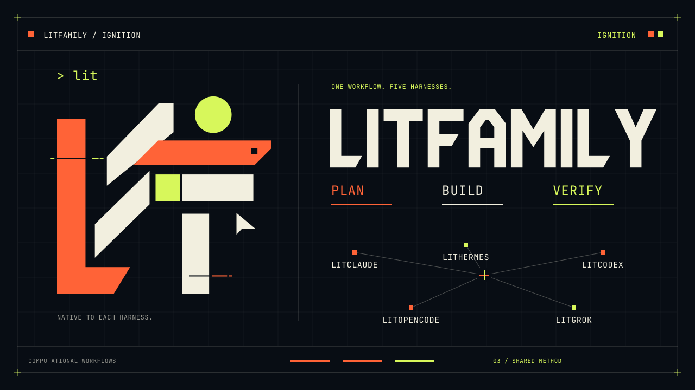](assets/brand/exports/ignition-film.mp4)

## 실제 시작 경로와 편집 이미지

선택한 제품과 호스트에서 지원하는 경로만 사용하세요. 호스트가 bare route를 지원하면 `lit`이 작업 루프를 시작하고, `handoff`는 확인한 결과와 다음 단계를 남기며, `lit-plan`은 승인할 작업 경로를 정리하고, `/start-work`는 승인한 계획을 실행하며, `/review-work`는 결과를 살핍니다. `litresearch`는 선택한 제품이 문서로 제공할 때만 사용할 수 있습니다. Grok Build는 명시적 진입점으로 `/litwork`를 문서화합니다. 각 경로에는 제품별 호스트 제약이 있습니다. 이 허브는 선택지를 안내할 뿐 경로를 실행하거나 runtime을 설치하지 않으며, 지원하지 않는 경로를 추가하지 않습니다.

<table>
<tr>
<td><strong>LitClaude</strong><br /></td>
<td><strong>LitHermes</strong><br /></td>
<td><strong>LitCodex</strong><br /></td>
<td><strong>LitOpenCode</strong><br /></td>
<td><strong>LitGrok</strong><br /></td>
</tr>
</table>

## LITFAMILY


Claude, Hermes, Codex, OpenCode, Grok을 다섯 아머드 머신으로 그린 편집 일러스트입니다. 쓰는 도구에 맞는 제품을 고르세요. 소프트웨어 화면이 아니라 패밀리를 그린 그림입니다.

## 점화 표시

[](assets/brand/exports/ignition-film.mp4)

[10초 영상 재생](assets/brand/exports/ignition-film.mp4) · [움직이는 GIF](assets/brand/exports/ignition-demo.gif) · [정지 포스터](assets/brand/exports/ignition-poster.png) · [브랜드 갤러리](assets/brand/gallery.html)

LitFamily의 작업 흐름을 표현한 모션 그래픽입니다. 설치나 실제 호스트 실행을 녹화한 영상은 아닙니다. 움직이는 GIF와 10초 영상은 위 링크에서 볼 수 있습니다.

<details>
<summary>Ignition 커버</summary>

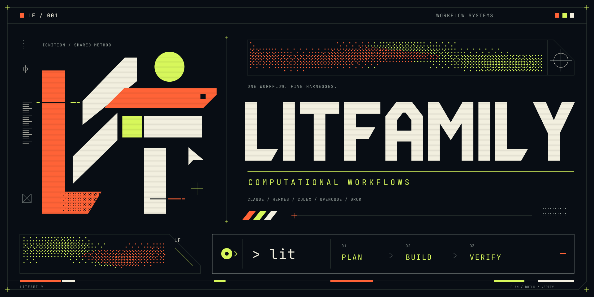

</details>


</details>
